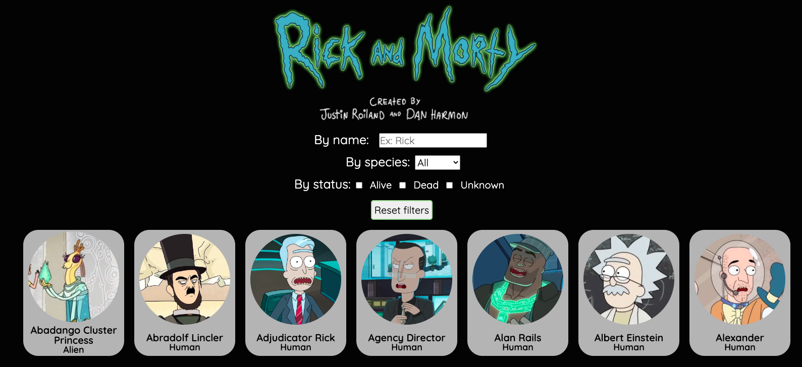

# Rick and Morty characters!

## Description

In this project there are one page where you can find some rick and morty's serie characters with some information about them, like image, name and specie. On these page exist three filters where you will be able to filter by name, species or status.
On the other hand, you will be able to click on whatever character you wish and you will be able to find more information about him.

## Tecnology

This project was created with **React**, but it also has some:

- **HTML**
- **CSS**
- **Git and GitHub Pages**
- **APIs**

First of all to run page you will need to install npm on terminal with:

    npm install

When installation is finished, you will run page with:

    npm start

To make these project, the API was: https://rickandmortyapi.com/documentation/#get-all-characters

## Result

You can take a look of how it ended up in Github Pages: https://github.com/Adalab/modulo-3-evaluacion-final-Luciakestel

### Create by _Lucía Kestel_ - @Luciakestel
